# Porkvision


## About
Exports from the Canadian pork industry generate $5 billion per year. Primal cuts with desirable quality attributes, especially loins, bellies and butts, are sold at premium prices in international markets, such as Japan. Current methods used for measuring pork quality, both in-line and under research conditions, are conducted through mainly subjective methods and manual testing on the loin primal. Fully automated systems are not usually available for the collection of quality data in pork primals or pork chops, and adoption of the few available technologies able to evaluate some quality traits has been limited due to high costs and operational requirements. This project has developed a new application to evaluate the center pork chops of loin primals (gold standard location for evaluation of pork quality) based on the most important quality attributes required by domestic and international buyers. Using an existing large pork phenomics image bank and dataset generated at the AAFC Lacombe Research and Development Centre (Lacombe, AB), the system was developed and validated under conditions mimicking commercial processing.

This project implements an end-to-end Python-based image analysis pipeline to automate the evaluation of pork chops using computer vision and deep learning techniques. It replicates manual workflows traditionally performed using ImageJ and custom macros, streamlining the process while maintaining compatibility with the Canadian pork colour and marbling standards.

The pipeline extracts quantitative measurements such as muscle width and depth, fat depth, marbling percentage, and color score from standardized pork chop images. It is designed to process large batches efficiently, making it well-suited for research and industry applications alike.

Developed entirely in Python, the system leverages libraries such as PyTorch, OpenCV, and NumPy, and integrates deep learning models including:
- A segmentation model for fat and muscle isolation
- A YOLOv11 object detection model for identifying color standards
- Custom image preprocessing and measurement algorithms for geometry and intensity-based analysis

---

## OVERVIEW

The pork chop images have the following characteristics:
- The pork loin is placed in the centre of a white tray
- Three color reference palettes are placed along the left, top, and bottom inner edges of the tray.
- A ruler is aligned consistently beside the pork chop to the right inner edge of the tray.

<p align="center">
    
</p>

In current practice, trained personnel use ImageJ along with pre-defined macros to measure features on pork chop images. These include:
- Muscle Width: The longest horizontal segment across the longissimus dorsi (LD) muscle.
- Muscle Depth: Measured 7 cm from the midline, perpendicular to the skin, at the CAN grading site (Pomar et al., 2001).
- Fat Depth: The vertical distance from skin through the fat layer above the muscle.
- Marbling: Estimated as the proportion of intramuscular fat within the LD muscle.
- Color Score: Based on proximity to standard color references.

<p align="center">
    
</p>

The automated image analysis pipeline performs the measurements described above through a sequence of modular stages, as outlined below and in the flowchart and images:

**Process Flowchart**:

```mermaid
flowchart LR
    A{{Input:<br>Raw Images & Neural Network}} --> B[Select Segmentation Mask]
    B --> C[Convert Contours<br>to Masked Images]
    C --> D[Correct Image<br>Orientation]
    D --> E[Compute mm/px:<br>Conversion Factor]
    E --> F[Detect<br>Marbling]
    F --> G[Standardize<br>LAB Color Channels]
    G --> H[Classify Muscle<br>Color Score]
    H --> I[Measure:<br>Muscle Width & Depth<br>Fat Depth]
    I --> J[Draw Measurements<br>on Annotated Image]
    J --> K{{Output:<br>Processed Images & CSV}}
```



   
### 1. Preprocessing

A trained segmentation model identifies and isolates **fat** and **muscle** regions in the input image. These masks form the foundation for all downstream measurements.

### 2. Orientation Standardization

To ensure uniform input across samples:

- The spatial relationship between fat and muscle masks is analyzed.
- The image is rotated, if necessary, so that the **fat layer** is always positioned **above** the muscle.

### 3. Conversion Factor Calculation

To establish real-world scale using OpenCV:

- **Canny edge detection** and **HoughLinesP** are used to detect ruler lines.
- Lines **longer than 2000 px** are assumed to represent a valid portion of a physical ruler (typically **15.5 cm ≈ 2137 px**).
- A **mm/px conversion factor** is calculated from this line.
- If no ruler is detected, a **default conversion factor** of **10 mm / 140 px** is applied.

### 4. Marbling Detection

Focused on the muscle mask:

- Edge fat and background artifacts are removed.
- Contrast is dynamically adjusted, and color enhancement is applied via **LUT**.
- Marbling regions are extracted using thresholding.
- **Marbling percentage** is computed as the ratio of **marbled area** to **total muscle area**.

### 5. Color Score

Using a YOLOv11-based model:

- The model detects the **Canadian Color Standard** palettes in the image.
- Muscle region colors are mapped to the closest standard using **Euclidean distance**.
- The output includes the **percentage breakdown** of matched color standards.

### 6. Muscle & Fat Measurements

Geometric analysis of the segmentation masks provides:

- **Muscle Width**: Longest horizontal span of the muscle mask.
- **Muscle Depth**: Vertical depth measured **7 cm from the midline**.
- **Fat Depth**: Vertical distance from the **top of the fat layer** to the **muscle** at the muscle depth coordinate.

### 7. Post-Processing and Output

The final output includes:

- Results saved to: `output/results.csv`
- Annotated images stored in: `output/annotated_images/`
- ROI files saved to: `output/rois/` for manual review or correction of measurements.

---

## DATA

The dataset used in this project was compiled from pork quality studies conducted over several years. These images were used to train the neural networks employed in the pipeline. All files are in JPG format with a resolution of 5184×3456 or 3456×5184 pixels, depending on orientation. To run the analysis, images should be placed in the data/ directory and follow a consistent naming convention.

Example filename: 103_LdLeanColor.JPG

---

## PARAMETERS

## **General Parameters**
| **Parameter**         | **Description**                                      | **Default Value**                  |
|-----------------------|------------------------------------------------------|------------------------------------|
| `--image_path`        | Path to input image(s) for processing.               | `"data/"`               |
| `--output_path`       | Directory where results are saved.          | `"output/"`       |
| `--model_path`        | Path to the trained YOLOv11 segmentation model.         | `"src/models/Yolo_MuscleFatSegment_98epoch.pt"`             |
| `--color_model_path` | Path to the trained YOLOv11 detection model. | `"src/models/color_100_last.pt"` |
| `--minimal` | Option to specify if you want to save non-outlier images | False |
| `--debug` | Option to specify if you want to see extra information/images | False |
| `--outputs` | Option to specify which modules you would like to run (e.g. measurement, marbling, colour, all) | all |

---

## **Measurement Variables**
| **Variable**      | **Description**                                  | **Default Value**|
|--------------------|--------------------------------------------------|------------------|
| `cm_to_pixels`     | Conversion factor for cm to pixels.              | `140` px/cm      |
| `step`             | Step size in pixels to sample along line         | `1.0` px         |
| `max_iter`         | Maximum iterations to avoid infinite loops       |`10000` iterations|

---

## **Orientation Variables**
| **Variable** | **Description** | **Default Value**                     |
| ------------- | --------------- | ------------------------------------- |
| `min_area`    | Minimum area to be considered valid         | `500` px  |
| `kernel_size` | Size of the dilation kernel                 | `15` px   |
|`dilation_size`| Pixel size for dilation to define adjacency | `15` px   |

---

## **Image Processing Variables**
| **Variable**         | **Description**                                      | **Default Value** |
|-----------------------|------------------------------------------------------|-------------------|
| `confidence_threshold` | Minimum confidence score for valid detection | `0.4` |

---

## **Marbling Variables**
| **Variable** | **Description**                     | **Default Value**          |
|---------------|-------------------------------------|----------------------------|
| `kernel_size` | Size of the Gaussian kernel         | `11`                       |
| `lut`         | The colormap that is used           | `COLORMAP_JET`             |
| `kernel_size` | Size of the Gaussian kernel         | `(5, 5)`                   |
| `gamma`       | Gamma correction factor             | `0.3`                      |
| `min_area`    | Min area to be considered           | `5` px                     |
| `clip_limit`  | CLAHE | `2.0` |
| `tile_grid_size` | CLAHE | `(8, 8)` | 
| `base_filename` | The image name | `None` |

---

## **Coloring Variables**
| **Variable** | **Description**                     | **Default Value**          |
|---------------|-------------------------------------|----------------------------|
| `class_to_std` | The YOLO classes and what standard they correspond to | `Inverted (class 0 = standard 6)` |

---


## USAGE

### Pre-requisites

#### Programming Languages, Libraries, and frameworks
  - python=3.9
  - ultralytics=8.2.34
  - segment-anything=1.0.1
  - numpy=2.0.0
  - pandas=2.2.3
  - pytorch=2.5.1
  - scikit-image=0.24.0
  - roifile
  - tabulate
  - opencv
  - scipy

#### Installation

1. Ensure you have Conda installed and are inside the root directory of the project repository.
2. Create the environment using the provided environment file:

    ```
    conda env create -f environment.yml
    ```

3. Activate the environment

    ```
    conda activate porkvision-1.0.0
    ``` 

#### Setup & Execution

Before running the pipeline, ensure that:
- All files are organized in their correct directories.
- The required models are placed in: src/models/

To execute the pipeline, use the following command:

    ```
    sbatch porkvision.sh
    ```

---

## OUTPUT

Processed results will be saved in the output directory, organized into the following subfolders:
- annotated_images/ – images with visualized measurements
- segment/ – segmentation mask outputs
- marbling/ – marbling detection results
- colouring/ – color grading results
- rois/ – saved ROI files for optional manual review or correction


```
|-- config
|   |-- environment.yml
|   `-- requirements.txt
|-- data [Dataset to test on, by default 1 image; can contain any amount]
|   |-- 103_LdLeanColor.JPG
|-- docs
|    |-- index.md
|    |-- loin_segmentation_project_report.docx   [Older version report by Edward/Fatima]
|    |-- deprecated_functions.txt [functions no longer in use, kept for archiving purposes]
|-- output 
|    |-- .gitkeep    
|    |-- annotated_images
|    |   |-- 103_LdLeanColor_annotated.JPG
|    |-- rois
|    |   |-- 103_LdLeanColour_fat.roi
|    |   |-- 103_LdLeanColour_horizontal.roi
|    |   `-- 103_LdLeanColour_vertical.roi
|    |-- measurement.csv
|    |-- colouring.csv
|    |-- marbling.csv
|    |-- colouring
|    |   `-- Folders for each image containing LUTs + Color_Standard detection image
|    |-- marbling
|    |   `-- Folders for each image containing marbling masks, muscle region, fat mask
|    |-- log.out
|     `-- predict
|         `-- 103_LdLeanColor.jpg
|-- src
|    |-- models
|    |    |-- color_100_last.pt
|    |    |-- last.pt [Old segmentation model]
|    |     `-- Yolo_MuscleFat_Segment_98epoch.pt [New segmentation model] 
|    |-- utils
|    |   |-- colouring.py
|    |   |-- imports.py
|    |   |-- marbling.py
|    |   |-- measurement.py
|    |   |-- orientation.py
|    |   |-- postprocess.py
|    |   `-- preprocess.py
|    `-- main.py
|-- tests
|-- .gitignore
|-- CITATION.cff
|-- CITATIONS.md
|-- CODE_OF_CONDUCT.md
|-- CONTRIBUTING.md
|-- porkvision.sh
|-- SECURITY.md
|-- LICENSE
|-- README.md
 `-- requirements.txt
```

## KNOWN ISSUES
N/A

---

## CREDITS

- Fatima Davelouis (Bioinformatician | Oct. 2023 - Feb. 2024): developed an initial version of the image analysis code to annotate a subset of images using a pre-trained U-Net model, combined with geometry-based analysis to extract muscle and fat measurements.
- Edward Yakubovich (Bioinformatician | Apr. 2024 - Dec. 2024): trained new models using YOLO and SAM, and modified the code to extract muscle and fat measurements from a more diverse set of images.
- Maaz Ali (Student bioinformatician | Jan. - Apr. 2025): designed the overall pipeline architecture, re-implemented the core codebase, managed version control using GitHub, and co-authored the project documentation. Additionally, retrained the fat segmentation model and trained a new color detection model. Developed modules for preprocessing, orientation, marbling, colouring, measurement, and post-processing.
- Sean Hill (Student bioinformatician | From Jan. 2025): designed the overall pipeline architecture, re-implemented the core codebase, managed version control using GitHub, and co-authored the project documentation. Additionally, developed modules for preprocessing, orientation, marbling, colouring, measurement, and post-processing.
- Tarek Ibrahim (Student bioinformatician | Jan. - Apr. 2025): Assisted with initial code refactoring.
- Arun Kommadath (Bioinformatics team lead): coordinated project activities, performed code testing, reviewed documentation, and provided overall supervision and guidance.
- Manuel Juarez (Research scientist): conceptualised the project and provided domain-specific expertise in meat science and grading standards, and advised on heuristic refinement.
- Bethany Uttaro (Research scientist | retired): developed ImageJ macros based on domain-specific expertise in meat science and grading standards.
- Sophie Zawadski (Research technician | retired): managed image data, manually annotated images and developed ImageJ macros.
- Rhona Thacker (Research technician): managed image data, manually annotated images, applied ImageJ macros, reviewed annotated images and provided feedback for heuristic refinement.
- Lacey Hudson (Research technician): manually annotated images, applied ImageJ macros, reviewed annotated images and provided feedback for heuristic refinement.

---

## CONTRIBUTION
If you would like to contribute to this project, please consult [CONTRIBUTING.md](.github/CONTRIBUTING.md)

---

## COPYRIGHT
Government of Canada, Agriculture & Agri-Food Canada

---

## LICENSE
This project is licensed under the GPLv3 License. See [LICENSE](LICENSE) for details.

---

## PUBLICATIONS & ADDITIONAL RESOURCES

An extensive list of references for the tools used can be found in the [CITATIONS.md](CITATIONS.md) file.

---

## CITATION

If you use this repository for your analysis, please cite it using the [CITATION.cff](CITATION.cff) file.


