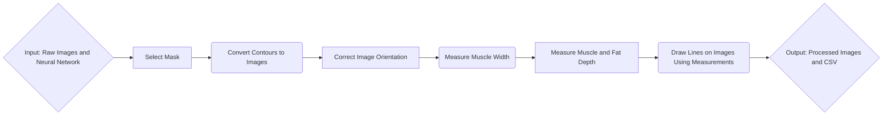

# Porkvision
[](https://opensource.org/licenses/MIT)

## ABOUT
This project seeks to utilize computer vision in order to automate measurement of the width and depth of the muscle and fat region.
To manually measure these dimensions, employees use some pre-defined heuristics: \
a)	The desired muscle width is defined as the length of the longest line segment that extends horizontally across the LD muscle. \
b)	The muscle depth is measured 7 cm from the midline of the carcass and perpendicular to the skin. This is the measurement site used in the Canadian grading system (CAN site), (Pomar et al., 2001); \
c)	The fat depth: the portion of the vertical line segment defined in (b) that extends through the upper fatty tissue.

We use an object detection model in order to automate this. All images used are similar to the one shown below, with the carcass contained in a white tray, as well as 3 color palettes (on the left, above, and below the carcass), there is a ruler that is consistently besides the pork loin carcass.

<p align="center">
    
</p>

We wish to automate this tedious process while retaining acceptable accuracy.

---

## TABLE OF CONTENTS
| **Section**                                | **Description**                                                                                           |
|--------------------------------------------|-----------------------------------------------------------------------------------------------------------|
| [ABOUT](#about)                            | An overview of the PorkVision project, including its purpose and process. |
| [OVERVIEW](#overview)                      | A more detailed step-by-step explanation of the project's processes, supported by a pipeline diagram illustrating the workflow. |
| [DATA](#data)                              | Information about the dataset used, including its structure, example images, and naming conventions.      |
| [PARAMETERS](#parameters)                  | A detailed reference to the parameters used throughout the project, categorized by functionality. |
| [USAGE](#usage)                            | Instructions on setting up and running the project, including pre-requisites, environment setup, and usage examples. |
| &nbsp;&nbsp;&nbsp;&nbsp;[Pre-requisites](#pre-requisites) | A list of required dependencies, tools, and software to ensure the project runs correctly.                |
| &nbsp;&nbsp;&nbsp;&nbsp;[Instructions](#instructions)    | Step-by-step directions to execute the code and process data, with examples and troubleshooting tips.     |
| &nbsp;&nbsp;&nbsp;&nbsp;[Notes](#notes)                     | Optional details, tips, or alternative methods for running the project effectively.                       |
| [OUTPUT](#output)                          | A description of the files and directories generated, including results such as CSVs and annotated images. |
| [KNOWN ISSUES](#known-issues)              | A record of known bugs or limitations in the project, with workarounds or references to potential fixes.  |
| [CREDITS](#credits)                        | Acknowledgment of contributors, organizations, and teams that supported the project.                     |
| [CONTRIBUTION](#contribution)              | Guidelines for contributing to PorkVision, including links to the `CONTRIBUTING.md` file.                |
| [COPYRIGHT](#copyright)                    | Ownership details and intellectual property rights related to the project.                               |
| [LICENSE](#license)                        | Licensing information for PorkVision, including a link to the `LICENSE` file for terms of use.           |
| [PUBLICATIONS & ADDITIONAL RESOURCES](#publications--additional-resources) | References to related publications, resources, and supplementary materials.                              |
| [CITATION](#citation)                      | Guidelines for citing PorkVision, with references to the `CITATION.cff` and `CITATIONS.md` files.        |

---

## OVERVIEW
The steps this code performs can be split into smaller processes.
### **1. Pre-Processing**  
- A **trained YOLOv8 segmentation model** extracts and isolates the **muscle mask** from the image.  
- These **binary masks** (`1 = muscle/fat, 0 = background`) serve as input for measurement functions.


### **2. Orientation**  
Some images may be captured in different orientations (fat on the left, right, or bottom). To standardize inputs:  
- The **fat and muscle masks** are analyzed to determine their relative positions.  
- The image is **rotated in 90° increments** until the fat is positioned **on top** of the muscle.    


### **3. Image Analysis – Muscle Measurement**  
Using **geometric analysis** of the muscle mask, we compute:  
- **Muscle Width:** Measured as the **longest horizontal line** between the leftmost and rightmost points of the muscle mask.  
- **Muscle Depth:** Measured as the vertical line 7cm inward from the midline of the carcass.     
- The **x-coordinate** of the muscle depth measurement is used to **extend a vertical line upward** into the fat region.  
- The **fat depth** is computed as the **distance between the topmost and bottommost points of the fat mask** at the selected x-coordinate.  


### **4. Post-Processing & Output**  
- Measurements are **saved to a CSV file** (`output/results.csv`).    
- Annotated images with **width, depth, and fat measurements drawn as overlay lines** are saved to `output/annotated_images/`.   

**Example**:


---

## DATA

The dataset that was used was obtained from a 2019 study of 209 pork loin carcasses. These were used to train the neural network that is used within this project; only 4 out of the 209 images are made available within this project itself, and all are in a JPG format with a resolution of 5184x3456p. The images can be found under the raw_images directory and are named similarly. 

**Example:**
- **724_LDLeanColour.JPG**

---

## PARAMETERS

## **General Parameters**
| **Parameter**           | **Description**                                           | **Default Value** |
|------------------------|------------------------------------------------------|------------------|
| `--image_path`        | Path to input image(s) for processing.               | `"data/raw_images/"` |
| `--output_path`       | Directory where annotated images are saved.          | `"output/annotated_images/"` |
| `--results_csv`       | CSV file where measurement results are stored.       | `"output/results.csv"` |
| `--model_path`        | Path to the trained YOLO segmentation model.         | `"src/models/last.pt"` |
| `--segment_path`      | Directory where segmentation masks are saved.        | `"output/segment/"` |

---

## **Measurement Parameters**
| **Parameter**        | **Description**                                        | **Default Value** |
|--------------------|--------------------------------------------------|------------------|
| `cm_to_pixels`    | Conversion factor for cm to pixels.              | `140` px/cm |
| `depth_offset_cm` | Distance (cm) from the midline for depth measurement. | `7` cm |

---

## **Image Processing Parameters**
| **Parameter**         | **Description**                                      | **Default Value** |
|----------------------|------------------------------------------------|------------------|
| `dilation_size`     | Size of dilation for adjacent fat detection. | `15` pixels |
| `rotate_increment`  | Image rotation for reorienting fat. | `90` degrees |

---

## USAGE
### Pre-requisites
**Programming Languages, Libraries, and frameworks**
   - python=3.9
   - ultralytics
   - segment-anything
   - ipykernel
   - numpy
   - opencv
   - matplotlib
   - pillow
   - shapely
   - scikit-image
   - pandas
   - scipy

**Installation** \
    1. Make sure to have conda installed and that you are in the project's repository. \
    2.
    ```
    conda env create -f environment.yml
    ``` \
    3.
    ```
    conda activate yolosam_env
    ``` \
    4. 
    ```
    pip install lsq-ellipse
    ```

### Instructions
1. Ensure everything is contained to it's proper location.
2. Make sure to have last.pt in the src/models directory.
3. Run with the following:
    ```
    python src/main.py
    ```
4. The results can be found in the annotated_images and segment subdirectories of the output folder.

### Notes
IF the environment cannot be created using environment.yml. \
TRY:
```
conda create -n yolosam_env python=3.9 -c conda-forge \
ultralytics segment-anything ipykernel \
numpy opencv matplotlib pillow \
shapely scikit-image pandas scipy

conda activate yolosam_env

pip install lsq-ellipse
pip install tabulate
```

### Instructions
1. Ensure everything is contained to it's proper location.
2. Make sure to have last.pt in this directory.
3. Run normally.
4. The results can be found in the runs subdirectory.

---

## OUTPUT
```
|-- config
|   `--environment.yml
|-- data/raw_images                              [4 test images in different orientations]
|   |-- 1701_LdLeanColor.JPG
|   |-- 1704_LdLeanColor.JPG
|   |-- 2401_LdLeanColor.JPG
|   `-- 724_LDLeanColour.JPG
|-- docs
|    |-- index.md
|    |-- loin_segmentation_project_report.docx   [Older version report by Fatima]
|-- output**     
|    |-- annotated_images**
|    |   |-- 1701_LdLeanColor_annotated.JPG**
|    |   |-- 1704_LdLeanColor_annotated.JPG**
|    |   |-- 2401_LdLeanColor_annotated.JPG**
|    |   |-- 724_LDLeanColour_annotated.JPG**
|    |-- results.csv**
|    `-- segment
|        |-- predict**
|            |-- 1701_LdLeanColor.jpg**
|            |-- 1704_LdLeanColor.jpg**
|            |-- 2401_LdLeanColor.jpg**
|            `-- 724_LDLeanColour.jpg**
|-- src
|    |-- models
|    |-- utils
|    |   |-- measurement.py
|    |   |-- orientation.py
|    |   |-- postprocess.py
|    |   |-- preprocess.py
|    `-- main.py
|-- tests
|-- CITATION.cff
|-- CITATIONS.md
|-- LICENSE
|-- README.md
`-- requirements.txt
```
NOTE: A new predict Directory is created per run labelled predict**i** where **i** is an increasing integer. \
For example another run with the file structure above would create a predict2 folder.

## KNOWN ISSUES
N/A

---

## CREDITS
This repository was written by members of AAFC-Bioinfo-AAC-brouillon.

We thank the following people and teams for their assistance in the development of this project:
- Fatima Davelouis
- Edward Yakubovich
- Arun Kommadath
- Sean Hill
- Tarik Ibrahim
- Maaz Ali

---

## CONTRIBUTION
If you would like to contribute to this project, please consult [CONTRIBUTING.md](.github/CONTRIBUTING.md)

---

## COPYRIGHT
Government of Canada, Agriculture & Agri-Food Canada

---

## LICENSE
This project is licensed under the MIT License. See [LICENSE](LICENSE) for details.

---

## PUBLICATIONS & ADDITIONAL RESOURCES
**Index**
- [Index.md](docs/index.md)

**Documentation**
- [NumPy](https://numpy.org/doc/stable/)
- [Ultralytics/YOLO](https://docs.ultralytics.com/)
- [Segment Anything](https://github.com/facebookresearch/segment-anything)
- [IPyKernel](https://ipykernel.readthedocs.io/en/stable/)
- [OpenCV](https://docs.opencv.org/4.x/index.html)
- [matplotlib](https://matplotlib.org/stable/index.html)
- [Pillow](https://pillow.readthedocs.io/en/stable/)
- [Shapely](https://shapely.readthedocs.io/en/stable/)
- [scikit-image](https://scikit-image.org/docs/stable/)
- [pandas](https://pandas.pydata.org/docs/)
- [SciPy](https://docs.scipy.org/doc/scipy/)
- [tabulate](https://pypi.org/project/tabulate/)

---

## CITATION
If you use this repository for your analysis, please cite it using the [CITATION.cff](CITATION.cff) file. An extensive list of references for the tools used can be found in the [CITATIONS.md](CITATIONS.md) file.
