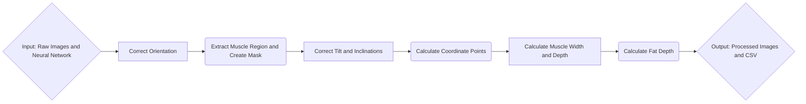

# Porkvision

## ABOUT
This project seeks to utilize computer vision in order to automate measurement of the width and depth of the muscle and fat region.
To manually measure these dimensions, employees use some pre-defined heuristics: \
a)	The desired muscle width is defined as the length of the longest line segment that extends horizontally across the LD muscle. \
b)	The muscle depth is measured 7 cm from the midline of the carcass and perpendicular to the skin. This is the measurement site used in the Canadian grading system (CAN site), (Pomar et al., 2001); \
c)	The fat depth: the portion of the vertical line segment defined in (b) that extends through the upper fatty tissue.

We use an object detection model in order to automate this. All images used are similar to the one shown below, with the carcass contained in a white tray, as well as 3 color palettes (on the left, above, and below the carcass), there is a ruler that is consistently besides the pork loin carcass.

    

We wish to automate this tedious process while retaining acceptable accuracy.

---

## TABLE OF CONTENTS
| **Section**                                | **Description**                                                                                           |
|--------------------------------------------|-----------------------------------------------------------------------------------------------------------|
| [ABOUT](#about)                            | A summary of the project, may include its origin, purpose, and functionality, along with configuration options. |
| [OVERVIEW](#overview)                      | A summary of the project's processes, supported by a visual representation (e.g., a pipeline diagram).    |
| [DATA](#data)                          | Details of the data files used in the project. |
| [PARAMETERS](#parameters)                  | A table describing configurable parameters, their expected values, and their impact on the output.      |
| [USAGE](#usage)                            | Detailed guidance on how to use the project, including pre-requisites, instructions, and optional notes.   |
| &nbsp;&nbsp;&nbsp;&nbsp;[Pre-requisites](#pre-requisites) | Dependencies and hardware/software requirements.                                                          |
| &nbsp;&nbsp;&nbsp;&nbsp;[Instructions](#instructions)    | Step-by-step directions for running the code, including examples and links to related resources.          |
| &nbsp;&nbsp;&nbsp;&nbsp;[Notes](#notes) | Additional optional details, tips, or alternative methods.                                               |
| [OUTPUT](#output)                          | Details of the output files generated, which may include formats, locations, and naming conventions. |
| [KNOWN ISSUES](#known-issues) | A section for documenting known bugs or limitations, along with potential workarounds or references.     |
| [CREDITS](#credits)                        | Acknowledgment of contributors, teams, and organizations that supported the project.                      |
| [CONTRIBUTION](#contribution)              | Guidelines for contributing to the repository, with a link to the `CONTRIBUTING.md` file.                 |
| [COPYRIGHT](#copyright)                    | Ownership details                     |
| [LICENSE](#license)                        | Information about the license, including a link to the `LICENSE` file.                           |
| [PUBLICATIONS & ADDITIONAL RESOURCES](#publications--additional-resources) | Links to publications, articles, or other resources related to the project.                             |
| [CITATION](#citation)                      | Instructions for citing the project, with references to the `CITATION.cff` and `CITATIONS.md` files.      |

---

## OVERVIEW
The steps this code performs can be split into smaller processes. \
1. Pre-process Images: Certain images are in an incorrect orientation, so we need to rotate to the correct orientation. \
2. Extract Region: By using our trained neural-network we are able to extract the region of muscle and create a muscle mask. \
3. Image Analysis of Muscle: Using left-, right-, top-, and bottom-most coordinate points on the muscle mask we can calculate the muscle width and depth. \
If necessary we correct for any tilts and inclinations of the loin carcass. \
4. Image Analysis for Fat: Since our Neural-network has not been trained for fat, we use the line segment for muscle depth and extend until we reach the upper boundary of fat. \
Then we measure the length of the line segment that extends across the fat. \
5. Post-processing: The measurements are saved into a csv file. Since the measurements are in pixels; they are converted to metric units. 

**Example**:

---

## DATA

The dataset that was used was obtained from a 2019 study of 209 pork loin carcasses. These were used to train the neural network that is used within this project; only 4 out of the 209 images are made available within this project itself, and all are in a JPG format with a resolution of 5184x3456p. The images can be found under the raw_images directory and are named similarly. 

**Example:**
- **724_LDLeanColour.JPG**

---

## PARAMETERS
| Parameter        | Value                  |
|------------------|------------------------|
| parameter_name_1 | Description of what the parameter does and the expected value (e.g., integer, string, file path). |
| parameter_name_2 | Description of what the parameter does and the expected value (e.g., boolean, list). |

---

## USAGE
### Pre-requisites
List the dependencies or software required to run the code. Include:
- Specific programming languages, libraries, or frameworks (e.g., Python 3.9, NumPy).
- Installation instructions for dependencies (e.g., pip install, conda environments).
- Hardware requirements, if any (e.g., CPU/GPU specifications, memory, specs used when running with SLURM).

### Instructions
**DETAILED** Step-by-step guide to running the code. Can include:
- Command-line examples or scripts to execute.
- Screenshots, images, or videos illustrating usage.
- Links to detailed documentation or tutorials.
- Diagrams showing data flow or system behavior.

### Notes
IF APPLICABLE: Any information, such as tips, warnings, or alternative ways to run the code.

OTHERWISE: Write N/A

---

## OUTPUT
Describe the expected outputs of the code. Include:
- File types (e.g., `.csv`, `.txt`, `.bam`).
- Location of the files.
- File naming conventions.
- Examples of output files or links to them, if applicable.

---

## KNOWN ISSUES
IF APPLICABLE: List any known bugs, limitations, or issues with the current version of the code.
- Include workarounds or references to issues in the issue tracker, if available.

OTHERWISE: Write N/A

---

## CREDITS
**Example:**
"This repository was written by [Your Name/Team Name]."
"We thank the following people and teams for their assistance in the development of this project:"
- [Contributor 1]
- [Contributor 2]
- [Acknowledged Organizations or Teams]

---

## CONTRIBUTION
If you would like to contribute to this project, please consult [CONTRIBUTING.md](.github/CONTRIBUTING.md)

---

## COPYRIGHT
Government of Canada, Agriculture & Agri-Food Canada

---

## LICENSE
This project is licensed under the MIT License. See [LICENSE](LICENSE) for details.

---

## PUBLICATIONS & ADDITIONAL RESOURCES
IF APPLICABLE: Include any publications, articles, or additional resources that are related to the project.
- [Index.md_link](docs/index.md)
- Links to related papers or articles.
- References for bioinformatics tools or methods used in the code.

OTHERWISE: Write N/A

---

## CITATION
If you use this repository for your analysis, please cite it using the [CITATION.cff](CITATION.cff) file. An extensive list of references for the tools used can be found in the [CITATIONS.md](CITATIONS.md) file.