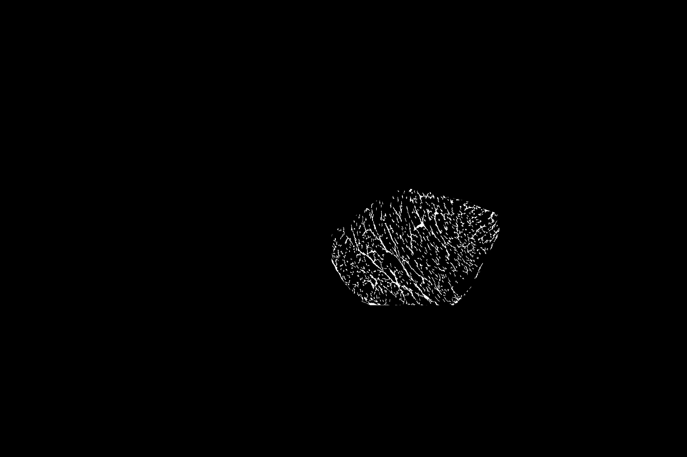
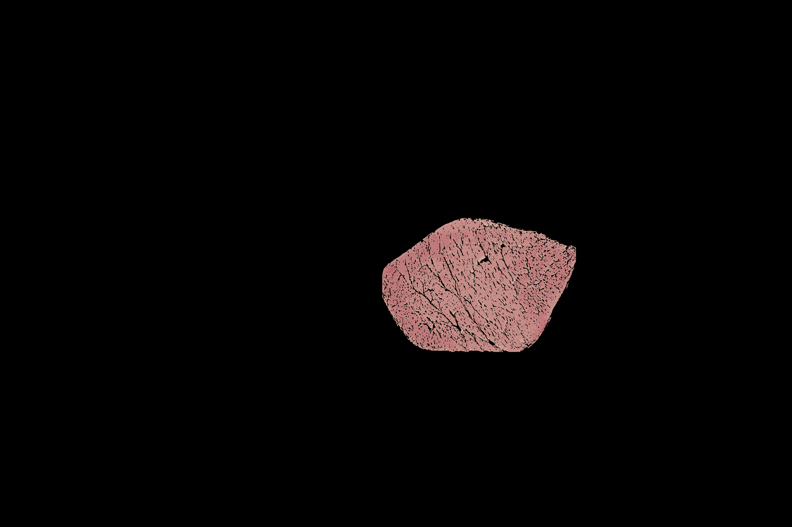
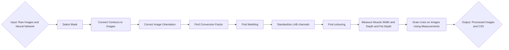

# Porkvision
[](https://opensource.org/licenses/MIT)

## ABOUT
This project seeks to utilize computer vision in order to automate the analysis of pork chops.
To manually measure these dimensions, employees use some pre-defined heuristics: \
a)	The desired muscle width is defined as the length of the longest line segment that extends horizontally across the LD muscle. \
b)	The muscle depth is measured 7 cm from the midline of the carcass and perpendicular to the skin. This is the measurement site used in the Canadian grading system (CAN site), (Pomar et al., 2001); \
c)	The fat depth: the portion of the vertical line segment defined in (b) that extends through the upper fatty tissue.
d)  The marbling percentage of the chop.
e)  The color grading of the chop.

We use an object detection model in order to automate this. All images used are similar to the one shown below, with the carcass contained in a white tray, as well as 3 color palettes (on the left, above, and below the carcass), there is a ruler that is consistently besides the pork loin carcass.

<p align="center">
    
</p>

We wish to automate this tedious process while retaining acceptable accuracy, like so:

<p align="center">
    
    
    
</p>

---

## TABLE OF CONTENTS
| **Section**                                | **Description**                                                                                           |
|--------------------------------------------|-----------------------------------------------------------------------------------------------------------|
| [ABOUT](#about)                            | An overview of the PorkVision project, introducing its purpose and process. |
| [OVERVIEW](#overview)                      | A detailed step-by-step explanation of the project's processes, supported by a pipeline diagram illustrating the workflow. |
| [DATA](#data)                              | Information about the dataset used, including its structure, example images, and naming conventions.      |
| [PARAMETERS](#parameters)                  | A detailed reference to the parameters used throughout the project, categorized by functionality. |
| [USAGE](#usage)                            | Instructions on setting up and running the project, including pre-requisites, environment setup, and usage examples. |
| &nbsp;&nbsp;&nbsp;&nbsp;[Pre-requisites](#pre-requisites) | A list of required dependencies, tools, and software to ensure the project runs correctly.                |
| &nbsp;&nbsp;&nbsp;&nbsp;[Instructions](#instructions)    | Step-by-step directions to execute the code and process data, with examples and troubleshooting tips.     |
| &nbsp;&nbsp;&nbsp;&nbsp;[Notes](#notes)                     | Optional details, tips, or alternative methods for running the project effectively.                       |
| [OUTPUT](#output)                          | A description of the files and directories generated, including results such as CSVs and annotated images. |
| [KNOWN ISSUES](#known-issues)              | A record of known bugs or limitations in the project, with workarounds or references to potential fixes.  |
| [CREDITS](#credits)                        | Acknowledgment of contributors, organizations, and teams that supported the project.                     |
| [CONTRIBUTION](#contribution)              | Guidelines for contributing to PorkVision, including links to the `CONTRIBUTING.md` file.                |
| [COPYRIGHT](#copyright)                    | Ownership details and intellectual property rights related to the project.                               |
| [LICENSE](#license)                        | Licensing information for PorkVision, including a link to the `LICENSE` file for terms of use.           |
| [PUBLICATIONS & ADDITIONAL RESOURCES](#publications--additional-resources) | References to related publications, resources, and supplementary materials.                              |
| [CITATION](#citation)                      | Guidelines for citing PorkVision, with references to the `CITATION.cff` and `CITATIONS.md` files.        |

---

## OVERVIEW
The steps this code performs can be split into smaller processes.
### **1. Pre-Processing**  
- A trained segmentation model extracts and isolates a mask for the fat and the muscle from the image.  
- These masks serve as input for measurement functions.


### **2. Orientation**  
Some images may be captured in different orientations (fat on the left, right, or bottom). To standardize inputs:  
- The fat and muscle masks are analyzed to determine their relative positions.  
- The image is rotated until the fat is positioned **on top** of the muscle.

### **3. Image Analysis - Conversion Factor Calculation**
Using OpenCV's Canny and HoughLinesP, we
- Search for any straight lines in the image focusing on lines larger than 2000px (near the size of a ruler).
- Using an estimation of 2137px for a 15.5cm ruler; we calculate the approximate cm value of the line and we get our conversion factor (mm/px).
- Find the total area of the muscle in px^2, and we convert into mm^2.
- Use the value of 10mm/140px if we are having difficulty finding a proper line.

### **4. Image Analysis - Marbling Measurement**
Using the binary muscle mask from our model, we:
- Cut out potential fat that may exist in the perimeter of our image/mask region.
- Preprocess the image to subtract the background, apply dynamic contrast stretch, and apply a LUT.
- Threshhold further in order to capture the marbling regions within the mask.
- Compare mask px to marbling px in order to determine marbling percentage.

### **5. Image Analysis - Color Grading**
We use a YOLOv11 model to detect the Canadian Color Standard and:
- Capture the lean muscle utilizing the muscle mask.
- Find the euclidean distances between a pixel and it's closest colour standard.
- Use this data to convert the colors of the lean muscle into their closest standard.
- Calculate the percentage of each standard in the muscle region.

### **6. Image Analysis – Muscle Measurement**  
Using geometric analysis of the muscle mask, we compute:  
- **Muscle Width:** Measured as the **longest horizontal line** between the leftmost and rightmost points of the muscle mask.  
- **Muscle Depth:** Measured as the vertical line 7cm inward from the midline of the carcass.     
- The **x-coordinate** of the muscle depth measurement is used to **extend a vertical line upward** into the fat region.  
- The **fat depth** is computed as the **distance between the topmost and bottommost points of the fat mask** at the selected x-coordinate.  


### **7. Post-Processing & Output**  
- Measurements are saved to a CSV file (`output/results.csv`).    
- Annotated images with width, depth, and fat measurements drawn as overlay lines are saved to `output/annotated_images/`.
- .roi files are saved to `output/rois/` incase a technician would like to manually verify measurements.    

**Process Flowchart**:


---

## DATA

The dataset that was used was obtained from studies of pork loin carcasses throughout the years. These were used to train the neural network that is used within this project. All are in a JPG format with a resolution of 5184x3456p or 3456px5184p. The images should be stored under the data directory and are named similarly. 

**Example:**
- **103_LdLeanColor.JPG**

---

## PARAMETERS

## **General Parameters**
| **Parameter**         | **Description**                                      | **Default Value**                  |
|-----------------------|------------------------------------------------------|------------------------------------|
| `--image_path`        | Path to input image(s) for processing.               | `"data/"`               |
| `--output_path`       | Directory where results are saved.          | `"output/"`       |
| `--model_path`        | Path to the trained YOLOv11 segmentation model.         | `"src/models/Yolo_MuscleFatSegment_98epoch.pt"`             |
| `--color_model_path` | Path to the trained YOLOv11 detection model. | `"src/models/color_100_last.pt"` |
| `--minimal` | Option to specify if you want to save non-outlier images | False |
| `--debug` | Option to specify if you want to see extra information/images | False |

---

## **Measurement Variables**
| **Parameter**      | **Description**                                  | **Default Value**|
|--------------------|--------------------------------------------------|------------------|
| `cm_to_pixels`     | Conversion factor for cm to pixels.              | `140` px/cm      |
| `step`             | Step size in pixels to sample along line         | `1.0` px         |
| `max_iter`         | Maximum iterations to avoid infinite loops       |`10000` iterations|

---

## **Orientation Variables**
| **Parameter** | **Description** | **Default Value**                     |
| ------------- | --------------- | ------------------------------------- |
| `min_area`    | Minimum area to be considered valid         | `500` px  |
| `kernel_size` | Size of the dilation kernel                 | `15` px   |
|`dilation_size`| Pixel size for dilation to define adjacency | `15` px   |

---

## **Image Processing Variables**
| **Parameter**         | **Description**                                      | **Default Value** |
|-----------------------|------------------------------------------------------|-------------------|
| `confidence_threshold` | Minimum confidence score for valid detection | `0.4` |

---

## **Marbling Variables**
| **Parameter** | **Description**                     | **Default Value**          |
|---------------|-------------------------------------|----------------------------|
| `kernel_size` | Size of the Gaussian kernel         | `11`                       |
| `lut`         | The colormap that is used           | `COLORMAP_JET`             |
| `kernel_size` | Size of the Gaussian kernel         | `(5, 5)`                   |
| `gamma`       | Gamma correction factor             | `0.3`                      |
| `min_area`    | Min area to be considered           | `5` px                     |
| `clip_limit`  | CLAHE | `2.0` |
| `tile_grid_size` | CLAHE | `(8, 8)` | 
| `base_filename` | The image name | `None` |

---

## **Coloring Variables**
| **Parameter** | **Description**                     | **Default Value**          |
|---------------|-------------------------------------|----------------------------|
| `class_to_std` | The YOLO classes and what standard they correspond to | `Inverted (class 0 = standard 6)` |

---


## USAGE
### Pre-requisites
**Programming Languages, Libraries, and frameworks**
  - python=3.9
  - ultralytics=8.2.34
  - segment-anything=1.0.1
  - numpy=2.0.0
  - pandas=2.2.3
  - pytorch=2.5.1
  - scikit-image=0.24.0
  - roifile
  - tabulate
  - opencv
  - scipy

**Installation** \
    1. Make sure to have conda installed and that you are in the project's repository. \
    2.
    ```
    conda env create -f environment.yml
    ``` \
    3.
    ```
    conda activate porkvision-1.0.0
    ``` 

### Instructions
1. Ensure everything is contained to it's proper location.
2. Make sure to have the proper models in src/models.
3. Run with the following:
    ```
    sbatch porkvision.sh
    ```
4. The results can be found in the annotated_images, segment, marbling, colouring, and rois subdirectories in the output folder.

---

## OUTPUT
```
|-- config
|   |-- environment.yml
|   `-- requirements.txt
|-- data [Dataset to test on, by default 1 image; can contain any amount]
|   |-- 103_LdLeanColor.JPG
|-- docs
|    |-- index.md
|    |-- loin_segmentation_project_report.docx   [Older version report by Edward/Fatima]
|    |-- deprecated_functions.txt [functions no longer in use, kept for archiving purposes]
|-- output 
|    |-- .gitkeep    
|    |-- annotated_images
|    |   |-- 103_LdLeanColor_annotated.JPG
|    |-- rois
|    |   |-- 103_LdLeanColour_fat.roi
|    |   |-- 103_LdLeanColour_horizontal.roi
|    |   `-- 103_LdLeanColour_vertical.roi
|    |-- measurement.csv
|    |-- colouring.csv
|    |-- marbling.csv
|    |-- colouring
|    |   `-- Folders for each image containing LUTs + Color_Standard detection image
|    |-- marbling
|    |   `-- Folders for each image containing marbling masks, muscle region, fat mask
|    |-- log.out
|     `-- predict
|         `-- 103_LdLeanColor.jpg
|-- src
|    |-- models
|    |    |-- color_100_last.pt
|    |    |-- last.pt [Old segmentation model]
|    |     `-- Yolo_MuscleFat_Segment_98epoch.pt [New segmentation model] 
|    |-- utils
|    |   |-- colouring.py
|    |   |-- imports.py
|    |   |-- marbling.py
|    |   |-- measurement.py
|    |   |-- orientation.py
|    |   |-- postprocess.py
|    |   `-- preprocess.py
|    `-- main.py
|-- tests
|-- .gitignore
|-- CITATION.cff
|-- CITATIONS.md
|-- CODE_OF_CONDUCT.md
|-- CONTRIBUTING.md
|-- porkvision.sh
|-- SECURITY.md
|-- LICENSE
|-- README.md
 `-- requirements.txt
```
## KNOWN ISSUES
N/A

---

## CREDITS
We thank the following people and teams for their assistance in the development of this project:
- Fatima Davelouis
- Edward Yakubovich
- Arun Kommadath
- Sean Hill
- Maaz Ali
- Manuel Juarez
- Sophie Zawadski
- Bethany Uttaro
- Lacey Hudson
- Ibrahim Tarik
- Rhona Thacker

---

## CONTRIBUTION
If you would like to contribute to this project, please consult [CONTRIBUTING.md](.github/CONTRIBUTING.md)

---

## COPYRIGHT
Government of Canada, Agriculture & Agri-Food Canada

---

## LICENSE
This project is licensed under the MIT License. See [LICENSE](LICENSE) for details.

---

## PUBLICATIONS & ADDITIONAL RESOURCES
- [Index.md](docs/index.md) [Contains documentation and additional installation instructions]
- [Ultralytics YOLOv11](https://docs.ultralytics.com/)
- [Segment Anything](https://github.com/facebookresearch/segment-anything)
- [matplotlib](https://matplotlib.org/stable/index.html)
- [NumPy](https://numpy.org/doc/stable/)
- [OpenCV](https://docs.opencv.org/4.x/index.html)
- [pandas](https://pandas.pydata.org/docs/)
- [SciPy](https://scipy.org/)
- [Shapely](https://shapely.readthedocs.io/en/stable/)
- [scikit-image](https://scikit-image.org/docs/stable/)
- [tabulate](https://pypi.org/project/tabulate/)
- [roifile](https://pypi.org/project/roifile/)

---

## CITATION
If you use this repository for your analysis, please cite it using the [CITATION.cff](CITATION.cff) file. An extensive list of references for the tools used can be found in the [CITATIONS.md](CITATIONS.md) file.
