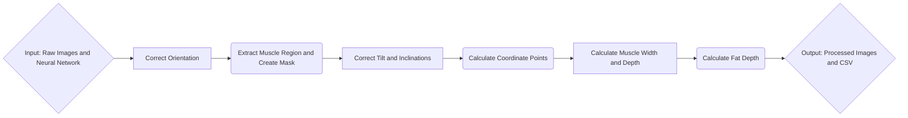

# Porkvision
[](https://opensource.org/licenses/MIT)

## ABOUT
This project seeks to utilize computer vision in order to automate measurement of the width and depth of the muscle and fat region.
To manually measure these dimensions, employees use some pre-defined heuristics: \
a)	The desired muscle width is defined as the length of the longest line segment that extends horizontally across the LD muscle. \
b)	The muscle depth is measured 7 cm from the midline of the carcass and perpendicular to the skin. This is the measurement site used in the Canadian grading system (CAN site), (Pomar et al., 2001); \
c)	The fat depth: the portion of the vertical line segment defined in (b) that extends through the upper fatty tissue.

We use an object detection model in order to automate this. All images used are similar to the one shown below, with the carcass contained in a white tray, as well as 3 color palettes (on the left, above, and below the carcass), there is a ruler that is consistently besides the pork loin carcass.

<p align="center">
    
</p>

We wish to automate this tedious process while retaining acceptable accuracy.

---

## TABLE OF CONTENTS
| **Section**                                | **Description**                                                                                           |
|--------------------------------------------|-----------------------------------------------------------------------------------------------------------|
| [ABOUT](#about)                            | An overview of the PorkVision project, including its purpose and process. |
| [OVERVIEW](#overview)                      | A more detailed step-by-step explanation of the project's processes, supported by a pipeline diagram illustrating the workflow. |
| [DATA](#data)                              | Information about the dataset used, including its structure, example images, and naming conventions.      |
| [PARAMETERS](#parameters)                  | A detailed reference to the parameters used throughout the project, categorized by functionality. |
| [USAGE](#usage)                            | Instructions on setting up and running the project, including pre-requisites, environment setup, and usage examples. |
| &nbsp;&nbsp;&nbsp;&nbsp;[Pre-requisites](#pre-requisites) | A list of required dependencies, tools, and software to ensure the project runs correctly.                |
| &nbsp;&nbsp;&nbsp;&nbsp;[Instructions](#instructions)    | Step-by-step directions to execute the code and process data, with examples and troubleshooting tips.     |
| &nbsp;&nbsp;&nbsp;&nbsp;[Notes](#notes)                     | Optional details, tips, or alternative methods for running the project effectively.                       |
| [OUTPUT](#output)                          | A description of the files and directories generated, including results such as CSVs and annotated images. |
| [KNOWN ISSUES](#known-issues)              | A record of known bugs or limitations in the project, with workarounds or references to potential fixes.  |
| [CREDITS](#credits)                        | Acknowledgment of contributors, organizations, and teams that supported the project.                     |
| [CONTRIBUTION](#contribution)              | Guidelines for contributing to PorkVision, including links to the `CONTRIBUTING.md` file.                |
| [COPYRIGHT](#copyright)                    | Ownership details and intellectual property rights related to the project.                               |
| [LICENSE](#license)                        | Licensing information for PorkVision, including a link to the `LICENSE` file for terms of use.           |
| [PUBLICATIONS & ADDITIONAL RESOURCES](#publications--additional-resources) | References to related publications, resources, and supplementary materials.                              |
| [CITATION](#citation)                      | Guidelines for citing PorkVision, with references to the `CITATION.cff` and `CITATIONS.md` files.        |

---

## OVERVIEW
The steps this code performs can be split into smaller processes. 
1. Pre-process Images: Certain images are in an incorrect orientation, so we need to rotate to the correct orientation. 
2. Extract Region: By using our trained neural-network we are able to extract the region of muscle and create a muscle mask. 
3. Image Analysis of Muscle: Using left-, right-, top-, and bottom-most coordinate points on the muscle mask we can calculate the muscle width and depth. \
If necessary we correct for any tilts and inclinations of the loin carcass. 
4. Image Analysis for Fat: Since our Neural-network has not been trained for fat, we use the line segment for muscle depth and extend until we reach the upper boundary of fat. \
Then we measure the length of the line segment that extends across the fat. 
5. Post-processing: The measurements are saved into a csv file. Since the measurements are in pixels; they are converted to metric units. 

**Example**:


---

## DATA

The dataset that was used was obtained from a 2019 study of 209 pork loin carcasses. These were used to train the neural network that is used within this project; only 4 out of the 209 images are made available within this project itself, and all are in a JPG format with a resolution of 5184x3456p. The images can be found under the raw_images directory and are named similarly. 

**Example:**
- **724_LDLeanColour.JPG**

---

## PARAMETERS

To address the extensive number of parameters used in the PorkVision source code, there is a dedicated `parameters.md` file located in the `docs/` directory. This document serves as a centralized and structured reference for all parameters categorized by their role in the process.

### Navigating `parameters.md`

For your convenience, the file includes a **Table of Contents** with direct links to each major section. Below is an overview of the main sections, with corresponding links to help you navigate directly to the information you need:

1. [Helper Function Parameters](/docs/parameters.md#1-helper-function-parameters)  
   - [Calculations](/docs/parameters.md#11-calculations): Covers functions for calculating measurements such as depth, width, and bounding box midpoints.  
   - [Correctors](/docs/parameters.md#12-correctors): Describes functions for correcting and refining measurements and orientations.  
   - [Ellipse Fitting and Plotting](/docs/parameters.md#13-ellipse-fitting-and-plotting): Details functions for fitting and visualizing ellipses.  
   - [Line, Contour, and Image Manipulations](/docs/parameters.md#14-line-contour-and-image-manipulations): Includes functions for extending lines, handling contours, and manipulating masks.  
   - [Rotation and Orientation](/docs/parameters.md#15-rotation-and-orientation): Explains functions for detecting and adjusting orientations and rotations.  
   - [Visualizations](/docs/parameters.md#16-visualizations): Documents functions for drawing overlays, bounding boxes, and measurement lines.

2. [Inference Parameters](/docs/parameters.md#2-inference-parameters)  
   Covers parameters related to running YOLOv8 inference, including model paths, input images, and saving results.

3. [Main Script Parameters](/docs/parameters.md#3-main-script-parameters)  
   Details the parameters used in the main processing script for managing results, performing transformations, and generating measurements.

4. [Results Handling Parameters](/docs/parameters.md#4-results-handling-parameters)  
   Includes parameters for creating structured results, converting measurements, and exporting outputs to CSV files.

Start exploring the parameters documentation [here](/docs/parameters.md).

---

## USAGE
### Pre-requisites
**Programming Languages, Libraries, and frameworks**
   - python=3.9
   - ultralytics
   - segment-anything
   - ipykernel
   - numpy
   - opencv
   - matplotlib
   - pillow
   - shapely
   - scikit-image
   - pandas
   - scipy

**Installation** \
    1. Make sure to have conda installed and that you are in the project's repository. \
    2.
    ```
    conda env create -f environment.yml
    ``` \
    3.
    ```
    conda activate yolosam_env
    ``` \
    4. 
    ```
    pip install lsq-ellipse
    ```

**Notes** \
IF the environment cannot be created using environment.yml. \
TRY:
```
conda create -n yolosam_env python=3.9 -c conda-forge \
ultralytics segment-anything ipykernel \
numpy opencv matplotlib pillow \
shapely scikit-image pandas scipy

conda activate yolosam_env

pip install lsq-ellipse
pip install tabulate
```

### Instructions
1. Ensure everything is contained to it's proper location.
2. Make sure to have last.pt in this directory.
3. Run normally.
4. The results can be found in the runs subdirectory.

---

## OUTPUT
```
|-- README
|-- last.pt                                 [model trained using YOLOv8 based on training images derived from SAM]
|-- loin_segmentation_project_report.docx   [Older version report by Fatima]
|-- raw_images                              [4 test images in different orientations]
|   |-- 1701_LdLeanColor.JPG
|   |-- 1704_LdLeanColor.JPG
|   |-- 2401_LdLeanColor.JPG
|   `-- 724_LDLeanColour.JPG
-- output**                                     [Output folder]
|   |-- 1701_LdLeanColor_annotated.JPG**
|   |-- 1704_LdLeanColor_annotated.JPG**
|   |-- 2401_LdLeanColor_annotated.JPG**
|   |-- 724_LDLeanColour_annotated.JPG**
|   |-- results.csv**
|   `-- segment**
|       |-- predict**
|       |   |-- 1701_LdLeanColor.jpg**
|       |   |-- 1704_LdLeanColor.jpg**
|       |   |-- 2401_LdLeanColor.jpg**
|       |   `-- 724_LDLeanColour.jpg**
|-- test_yolosam_env.yml                    [conda env]
`-- yolo_testing_1.3_AK_edited.ipynb        [code]
```

4 directories, 9 files \
NOTE: A new predict Directory is created per run labelled predict**i** where **i** is an increasing integer. \
For example another run with the file structure above would create a predict3 folder.

## KNOWN ISSUES
N/A

---

## CREDITS
This repository was written by members of AAFC-Bioinfo-AAC-brouillon.

We thank the following people and teams for their assistance in the development of this project:
- Fatima Davelouis
- Edward Yakubovich
- Arun Kommadath
- Sean Hill
- Tarik Ibrahim
- Maaz Ali

---

## CONTRIBUTION
If you would like to contribute to this project, please consult [CONTRIBUTING.md](.github/CONTRIBUTING.md)

---

## COPYRIGHT
Government of Canada, Agriculture & Agri-Food Canada

---

## LICENSE
This project is licensed under the MIT License. See [LICENSE](LICENSE) for details.

---

## PUBLICATIONS & ADDITIONAL RESOURCES
**Index**
- [Index.md](docs/index.md)

**Documentation**
- [NumPy](https://numpy.org/doc/stable/)
- [Ultralytics/YOLO](https://docs.ultralytics.com/)
- [Segment Anything](https://github.com/facebookresearch/segment-anything)
- [IPyKernel](https://ipykernel.readthedocs.io/en/stable/)
- [OpenCV](https://docs.opencv.org/4.x/index.html)
- [matplotlib](https://matplotlib.org/stable/index.html)
- [Pillow](https://pillow.readthedocs.io/en/stable/)
- [Shapely](https://shapely.readthedocs.io/en/stable/)
- [scikit-image](https://scikit-image.org/docs/stable/)
- [pandas](https://pandas.pydata.org/docs/)
- [SciPy](https://docs.scipy.org/doc/scipy/)

---

## CITATION
If you use this repository for your analysis, please cite it using the [CITATION.cff](CITATION.cff) file. An extensive list of references for the tools used can be found in the [CITATIONS.md](CITATIONS.md) file.
