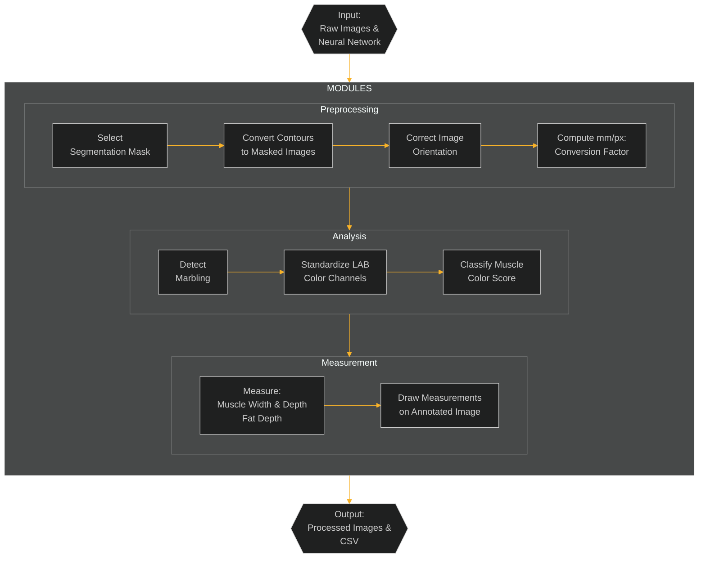

# PORKVISION


## About
Exports from the Canadian pork industry generate $5 billion per year. Primal cuts with desirable quality attributes, especially loins, bellies and butts, are sold at premium prices in international markets, such as Japan. Current methods used for measuring pork quality, both in-line and under research conditions, are conducted through mainly subjective methods and manual testing on the loin primal. Fully automated systems are not usually available for the collection of quality data in pork primals or pork chops, and adoption of the few available technologies able to evaluate some quality traits has been limited due to high costs and operational requirements.

Here we developed a Python-based image analysis pipeline using computer vision and deep learning techniques to automate the evaluation of center pork chops of loin primals (gold standard location for evaluation of pork quality) based on the most important quality attributes required by domestic and international buyers. Using an existing large pork phenomics image bank and dataset generated at the AAFC Lacombe Research and Development Centre (Lacombe, AB), the system was developed and validated under conditions mimicking commercial processing. It replicates manual workflows traditionally performed using ImageJ and custom macros, streamlining the process while maintaining compatibility with the Canadian pork colour and marbling standards.

The pipeline extracts quantitative measurements such as muscle width and depth, fat depth, marbling percentage, and color score from standardized pork chop images. It is designed to process large batches efficiently, making it well-suited for research and industry applications alike. Developed entirely in Python, the system leverages libraries such as PyTorch, OpenCV, and NumPy, and integrates:
- Deep Learning Models:
  - A segmentation model to isolate fat and muscle regions
  - A YOLOv11 object detection model for identifying embedded color standards
- Custom Algorithms:
  - Image preprocessing and measurement algorithms for geometry and intensity-based analysis
  
---

## Table of Contents
- [PORKVISION](#porkvision)
  - [About](#about)
  - [Table of Contents](#table-of-contents)
  - [Overview](#overview)
    - [1. Preprocessing](#1-preprocessing)
    - [2. Analysis](#2-analysis)
    - [3. Measurement](#3-measurement)
  - [Data](#data)
  - [Parameters](#parameters)
    - [General Parameters](#general-parameters)
    - [Measurement Variables](#measurement-variables)
    - [Orientation Variables](#orientation-variables)
    - [Image Processing Variables](#image-processing-variables)
    - [Marbling Variables](#marbling-variables)
    - [Coloring Variables](#coloring-variables)
  - [Usage](#usage)
    - [Pre-requisites](#pre-requisites)
      - [Programming Languages, Libraries, and frameworks](#programming-languages-libraries-and-frameworks)
      - [Installation](#installation)
    - [Instructions](#instructions)
    - [Notes](#notes)
  - [Output](#output)
  - [Credits](#credits)
  - [Contribution](#contribution)
  - [Copyright](#copyright)
  - [License](#license)
  - [Publications and Additional Resources](#publications-and-additional-resources)
  - [Citation](#citation)


## Overview

### Image characteristics and measurements

The pork chop images have the following characteristics:
- The pork loin is placed in the centre of a white tray
- Three color reference palettes are placed along the left, top, and bottom inner edges of the tray.
- A ruler is aligned consistently beside the pork chop to the right inner edge of the tray.

<p align="center">
    
</p>

In current practice, trained personnel use ImageJ along with pre-defined macros to measure features on pork chop images. These include:
- Muscle Width: The longest horizontal segment across the longissimus dorsi (LD) muscle.
- Muscle Depth: Measured 7 cm from the midline, perpendicular to the skin, at the CAN grading site (Pomar et al., 2001).
- Fat Depth: The vertical distance from skin through the fat layer above the muscle.
- Marbling: Estimated as the proportion of intramuscular fat within the LD muscle.
- Color Score: Based on proximity to standard color references.

<p align="center">
    
</p>

### Automated image analysis pipeline modules

The automated image analysis pipeline performs all image measurements indicated above, through a sequence of modular stages:
   
#### Preprocessing

Raw pork loin images are processed through a trained YOLOv11 segmentation model to identify **muscle** and **fat** regions. Using SAM-style mask extraction, the contours of these regions are converted into binary masks that drive all downstream analysis.

* **Mask Selection**: The model selects the most confident detections for each class (muscle = 0, fat = 1) and converts polygon contours into binary masks using `polygon2mask()`.
* **Orientation Correction**: The spatial layout of the muscle and fat masks is analyzed to standardize anatomical orientation. The image is rotated, if needed, to ensure the **fat region is always above the muscle**. A secondary fine-alignment step uses `cv2.fitEllipse()` to compute the dominant axis of the muscle and align it horizontally.
* **Scale Calibration**: The physical scale is established by detecting a known **15.5 cm ruler** in the image using **Canny edge detection** and **Hough Line Transform**. If a line is detected, a dynamic **mm/px conversion factor** is calculated. If detection fails or is out-of-bounds, a default fallback value of **10 mm / 140 px** is applied, logged, and the image is marked as an outlier. 


#### Analysis

The preprocessed image undergoes marbling detection and lean color classification using a combination of classical and deep learning methods:

* **Marbling Detection**: The extracted muscle region is enhanced using **CLAHE**, background subtraction, and **gamma correction** to generate a pseudo-colour image. The **blue channel** of the pseudo-image is thresholded to detect intramuscular fat. Morphological filtering and connected component analysis refine this into a high-precision **marbling mask**, from which the **marbling percentage** is computed relative to the cleaned muscle area.
* **Color Standardization**: A second YOLOv11 model detects embedded **Canadian lean color standards** (C0–C6) in each image. The **mode RGB values** within each detected bounding box are extracted and sorted to create a standard reference array.
* **Color Classification**: Pixels in the lean muscle area (excluding marbling) are classified by **Euclidean distance** to the closest color standard. A full **percentage breakdown** of how much muscle area maps to each standard is saved and visualized using a custom lookup table.


#### Measurement

Geometric computations are performed to quantify key anatomical measurements from the standardized and scaled masks:

* **Muscle Width**: Measured as the **longest axis perpendicular** to the rotation angle of the muscle, using search-based traversal across the major axis.
* **Muscle Depth**: Computed by tracing a vertical line offset from the midline of the carcass, aligned to the muscle's rotation angle. 
* **Fat Depth**: Determined by extending the muscle depth line into the fat mask until the top edge is reached.
* **Annotation and Export**: All measurement lines (width, depth, fat) are drawn on the rotated image. Final outputs include:

  * `output/measurement.csv` — Muscle/fat metrics in both pixels and mm
  * `output/marbling.csv` — Marbling percentage per image
  * `output/colouring.csv` — Muscle color class breakdowns
  * `output/annotated_images/` — Images with overlayed measurement lines
  * `output/rois/` — ImageJ-compatible ROI files for downstream validation

### Automated image analysis pipeline flowchart




---

## Data

The dataset used in this project was compiled from pork quality studies conducted over several years. A subset of about 100 images were used to train the neural networks employed in the pipeline. All files are in JPG format with a resolution of 5184×3456 or 3456×5184 pixels, depending on orientation. To run the analysis, images should be placed in the data/ directory and follow a consistent naming convention.

Example filename: 103_LdLeanColor.JPG

---

## Parameters

### General Parameters
| **Parameter**         | **Description**                                      | **Default Value**                  |
|-----------------------|------------------------------------------------------|------------------------------------|
| `--image_path`        | Path to input image(s) for processing.               | `"data/"`               |
| `--output_path`       | Directory where results are saved.          | `"output/"`       |
| `--model_path`        | Path to the trained YOLOv11 segmentation model.         | `"src/models/Yolo_MuscleFatSegment_98epoch.pt"`             |
| `--color_model_path` | Path to the trained YOLOv11 detection model. | `"src/models/color_100_last.pt"` |
| `--minimal` | Option to specify if you want to save non-outlier images | False |
| `--debug` | Option to specify if you want to see extra information/images | False |
| `--outputs` | Option to specify which modules you would like to run (e.g. measurement, marbling, colour, all) | all |

---

### Measurement Variables
| **Variable**      | **Description**                                  | **Default Value**|
|--------------------|--------------------------------------------------|------------------|
| `cm_to_pixels`     | Conversion factor for cm to pixels.              | `140` px/cm      |
| `step`             | Step size in pixels to sample along line         | `1.0` px         |
| `max_iter`         | Maximum iterations to avoid infinite loops       |`10000` iterations|

---

### Orientation Variables
| **Variable** | **Description** | **Default Value**                     |
| ------------- | --------------- | ------------------------------------- |
| `min_area`    | Minimum area to be considered valid         | `500` px  |
| `kernel_size` | Size of the dilation kernel                 | `15` px   |
|`dilation_size`| Pixel size for dilation to define adjacency | `15` px   |

---

### Image Processing Variables
| **Variable**         | **Description**                                      | **Default Value** |
|-----------------------|------------------------------------------------------|-------------------|
| `confidence_threshold` | Minimum confidence score for valid detection | `0.4` |

---

### Marbling Variables
| **Variable** | **Description**                     | **Default Value**          |
|---------------|-------------------------------------|----------------------------|
| `kernel_size` | Size of the Gaussian kernel         | `11`                       |
| `lut`         | The colormap that is used           | `COLORMAP_JET`             |
| `kernel_size` | Size of the Gaussian kernel         | `(5, 5)`                   |
| `gamma`       | Gamma correction factor             | `0.3`                      |
| `min_area`    | Min area to be considered           | `5` px                     |
| `clip_limit`  | CLAHE | `2.0` |
| `tile_grid_size` | CLAHE | `(8, 8)` | 
| `base_filename` | The image name | `None` |

---

### Coloring Variables
| **Variable** | **Description**                     | **Default Value**          |
|---------------|-------------------------------------|----------------------------|
| `class_to_std` | The YOLO classes and what standard they correspond to | `Inverted (class 0 = standard 6)` |

---


## Usage

### Pre-requisites

#### Programming Languages, Libraries, and frameworks
  - numpy=2.2.6
  - opencv=4.11.0
  - pandas=2.2.3  
  - python=3.13.3 
  - pytorch=2.7.0
  - roifile=2025.5.10
  - scikit-image=0.25.2
  - scipy=1.15.2
  - segment-anything=1.0.1
  - tabulate=0.9.0
  - ultralytics=8.3.146

#### Installation

1. Ensure you have Conda installed and are inside the root directory of the project repository.
2. Create the environment using the provided environment file:

    ```
    conda env create -f config/environment.yml
    ```

Also provided is a conda environment with all pinned versions of key packages used at the time of testing.


3. Activate the environment

    ```
    conda activate porkvision-1.0.0
    ``` 


### Instructions

Before running the pipeline, ensure that:
- All files are organized in their correct directories.
- The required models are placed in: src/models/

To execute the pipeline locally, use the following command:
```
python ./src/main.py
```

To execute the pipeline on an HPC with SLURM, first complete the SLURM directive placeholders in porkvision.sh script and then run the following command:

```
sbatch porkvision.sh
```

### Notes

When running the script, ignore the following warning if it shows:
```
***envs/porkvision-1.1.0/lib/python3.9/site-packages/numpy/_core/getlimits.py:545:
UserWarning: Signature b'\x00\xd0\xcc\xcc\xcc\xcc\xcc\xcc\xfb\xbf\x00\x00\x00\x00\x00\x00' 
for <class 'numpy.longdouble'> does not match any known type: falling back to type probe function.
This warning indicates broken support for the dtype!
  machar = _get_machar(dtype)
```
This warning can be safely ignored and typically does not affect script execution.

---

## Output

Processed results are saved in the `output` directory, organized as follows:

- **annotated_images/** – Images with visualized measurements (e.g., `annotated_*.JPG`)
- **colouring/** – Color grading results, including:
  - Detected color standard overlays (e.g., `*_Color_Detect.jpg`)
  - Canadian LUT visualizations (e.g., `*_canadian_lut.png`)
- **colouring.csv** – Tabular summary of color grading results for all processed images
- **debug/** – Debugging information and logs (e.g., `*_DEBUGINFO.txt`)
- **marbling/** – Marbling detection results, including:
  - Fat masks (e.g., `*_fat_mask.jpg`)
  - Marbling masks (e.g., `*_marbling_mask.jpg`)
  - Original and selective muscle masks
- **marbling.csv** – Tabular summary of marbling measurements
- **measurement.csv** – Tabular summary of muscle and fat measurements
- **predict/** – Segmentation or detection overlays for each image
- **rois/** – Saved ROI files for manual review or correction, organized per image:
  - Fat, horizontal, and vertical ROI files (e.g., `*_fat.roi`, `*_horizontal.roi`, `*_vertical.roi`)
- **ruler_measurement/** – Images showing detected ruler lines and conversion factors (e.g., `*_2133px-15.5cm.jpg`)

**Example output folder structure:**

An example of the output folder structure created from running the program with the test files in the data folder. A subfolder will be created for each processed image, organized by image name. CSV files provide summary tables for batch analysis.

```
output/
|-- annotated_images/
|   `-- annotated_103_LdLeanColor.JPG
|-- colouring/
|   `-- 103_LdLeanColor/
|       |-- 103_LdLeanColor_Color_Detect.jpg
|       `-- 103_LdLeanColor_canadian_lut.png
|-- colouring.csv
|-- debug/
|   `-- 103_LdLeanColor_DEBUGINFO.txt
|-- marbling/
|   `-- 103_LdLeanColor/
|       |-- 103_LdLeanColor_fat_mask.jpg
|       |-- 103_LdLeanColor_marbling_mask.jpg
|       |-- 103_LdLeanColor_original_muscle_mask.jpg
|       `-- 103_LdLeanColor_selective_muscle_mask.jpg
|-- marbling.csv
|-- measurement.csv
|-- predict/
|   `-- 103_LdLeanColor.jpg
|-- rois/
|   `-- 103_LdLeanColor/
|       |-- 103_LdLeanColor_fat.roi
|       |-- 103_LdLeanColor_horizontal.roi
|       `-- 103_LdLeanColor_vertical.roi
`-- ruler_measurement/
    `-- 103_LdLeanColor_2133px-15.5cm.jpg
```

---

## Credits

- Fatima Davelouis (Bioinformatician | Oct. 2023 - Feb. 2024): developed an initial version of the image analysis code to annotate a subset of images using a pre-trained U-Net model, combined with geometry-based analysis to extract muscle and fat measurements.
- Edward Yakubovich (Bioinformatician | Apr. 2024 - Dec. 2024): trained new models using YOLO and SAM, and modified the code to extract muscle and fat measurements from a more diverse set of images.
- Maaz Ali (Student bioinformatician | Jan. - Apr. 2025): designed the overall pipeline architecture, re-implemented the core codebase, managed version control using GitHub, and co-authored the project documentation. Trained models and developed modules for preprocessing, orientation, marbling, colouring, measurement, and post-processing. Additionally, retrained the fat segmentation model and trained a new color detection model. 
- Sean Hill (Student bioinformatician | From Jan. 2025): designed the overall pipeline architecture, re-implemented the core codebase, managed version control using GitHub, and co-authored the project documentation. Trained models and developed modules for preprocessing, orientation, marbling, colouring, measurement, and post-processing.
- Tarek Ibrahim (Student bioinformatician | Jan. - Apr. 2025): Assisted with initial code refactoring.
- Arun Kommadath (Bioinformatics team lead): coordinated project activities, performed code testing, reviewed documentation, and provided overall supervision and guidance.
- Manuel Juarez (Research scientist): conceptualised the project and provided domain-specific expertise in meat science and grading standards, and advised on heuristic refinement.
- Bethany Uttaro (Research scientist | retired): developed ImageJ macros based on domain-specific expertise in meat science and grading standards.
- Sophie Zawadski (Research technician | retired): managed image data, manually annotated images and developed ImageJ macros.
- Rhona Thacker (Research technician): managed image data, manually annotated images, applied ImageJ macros, reviewed annotated images and provided feedback for heuristic refinement.
- Lacey Hudson (Research technician): manually annotated images, applied ImageJ macros, reviewed annotated images and provided feedback for heuristic refinement.

---

## Contribution
If you would like to contribute to this project, please review the guidelines in [CONTRIBUTING.md](CONTRIBUTING.md) and ensure you adhere to our [CODE_OF_CONDUCT.md](CODE_OF_CONDUCT.md).

---

## Copyright
Government of Canada, Agriculture & Agri-Food Canada (AAFC)

---

## License
This project is licensed under the GPLv3 License. See [LICENSE](LICENSE) for details.

---

## Publications and Additional Resources

A list of references for the tools used can be found in the [CITATIONS.md](CITATIONS.md) file.

---

## Citation

If you use this repository for your analysis, please cite it using the [CITATION.cff](CITATION.cff) file.


