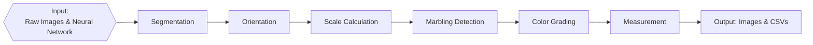

# Porkvision


## About

Porkvision is an end-to-end Python pipeline for automated, quantitative evaluation of pork chop images using computer vision and deep learning. It replaces subjective, manual workflows with reproducible, scalable, and standards-compliant analysis, supporting both research and industry needs.

Key features:
- **Segmentation** of muscle and fat using deep learning
- **Automated measurement** of muscle width, depth, fat depth, and marbling
- **Color grading** using Canadian pork color standards
- **Batch processing** and CSV reporting
- **Visual annotation** for quality control

---

## Project Structure

```
porkvision/
├── data/                # Input images
├── output/              # All results and processed images
├── src/                 # Source code modules
│   ├── models/          # Pretrained model files
│   ├── preprocessing.py
│   ├── orientation.py
│   ├── measurement.py
│   ├── marbling.py
│   ├── colouring.py
│   └── utils.py
├── environment.yml      # Conda environment specification
├── porkvision.sh        # SLURM batch script
└── README.md
```

---

## Pipeline Overview

1. **Preprocessing:** Segment muscle and fat regions using a trained YOLOv11 model.
2. **Orientation:** Standardize image orientation so fat is always above muscle.
3. **Scale Calculation:** Detect ruler, compute mm/px conversion.
4. **Marbling Detection:** Enhance contrast, extract marbling regions, compute marbling %.
5. **Color Grading:** Detect color standards, assign color scores using YOLOv11.
6. **Measurement:** Calculate muscle width, depth, and fat depth.
7. **Output:** Save annotated images, CSVs, and ROI files for review.

**Flowchart:**


---

## Installation

### Requirements

- Linux or Windows with Conda
- Python 3.9
- See `environment.yml` for all dependencies (PyTorch, OpenCV, ultralytics, etc.)

### Setup

```bash
conda env create -f environment.yml
conda activate porkvision-1.0.0
```

---

## Usage

1. Place images in `data/`.
2. Ensure models are in `src/models/`:
   - `Yolo_MuscleFatSegment_98epoch.pt` (segmentation)
   - `color_100_last.pt` (color detection)
3. Run the pipeline:

**On SLURM:**
```bash
sbatch porkvision.sh
```

**Locally:**
```bash
python src/main.py --image_path data/ --output_path output/
```

### Key Parameters

| Parameter           | Description                                      | Default                          |
|---------------------|--------------------------------------------------|----------------------------------|
| `--image_path`      | Input images directory                           | `data/`                          |
| `--output_path`     | Output directory                                 | `output/`                        |
| `--model_path`      | Segmentation model path                          | `src/models/Yolo_MuscleFatSegment_98epoch.pt` |
| `--color_model_path`| Color detection model path                       | `src/models/color_100_last.pt`    |
| `--minimal`         | Save only non-outlier images                     | `False`                          |
| `--debug`           | Output extra debug info                          | `False`                          |
| `--outputs`         | Modules to run (measurement, marbling, colour, all) | `all`                        |

See the README for advanced measurement, orientation, and marbling parameters.

---

## Output

Results are saved in `output/`:

- `annotated_images/` – Images with measurements drawn
- `colouring/` – Color grading overlays and LUTs
- `colouring.csv` – Color grading summary
- `debug/` – Debug logs
- `marbling/` – Marbling and fat masks
- `marbling.csv` – Marbling summary
- `measurement.csv` – Muscle and fat measurements
- `predict/` – Segmentation overlays
- `rois/` – ROI files for manual review
- `ruler_measurement/` – Ruler detection images

**Example:**
```
output/
|-- annotated_images/
|-- colouring/
|-- colouring.csv
|-- debug/
|-- marbling/
|-- marbling.csv
|-- measurement.csv
|-- predict/
|-- rois/
|-- ruler_measurement/
```

---

## Troubleshooting

- Ensure all dependencies are installed via Conda.
- Check `output/debug/` for logs if errors occur.
- Verify input image naming and format.
- Confirm model files are present in `src/models/`.

---

## Credits

- Fatima Davelouis, Edward Yakubovich, Maaz Ali, Sean Hill, Tarek Ibrahim, Arun Kommadath, Manuel Juarez, Bethany Uttaro, Sophie Zawadski, Rhona Thacker, Lacey Hudson

---

## Contribution

See [CONTRIBUTING.md](.github/CONTRIBUTING.md) for guidelines.

---

## License

GPLv3. See [LICENSE](LICENSE).

---

## Publications & Additional Resources

References for tools used are in [CITATIONS.md](CITATIONS.md).

---

## Citation

If you use this repository, please cite it using [CITATION.cff](CITATION.cff).