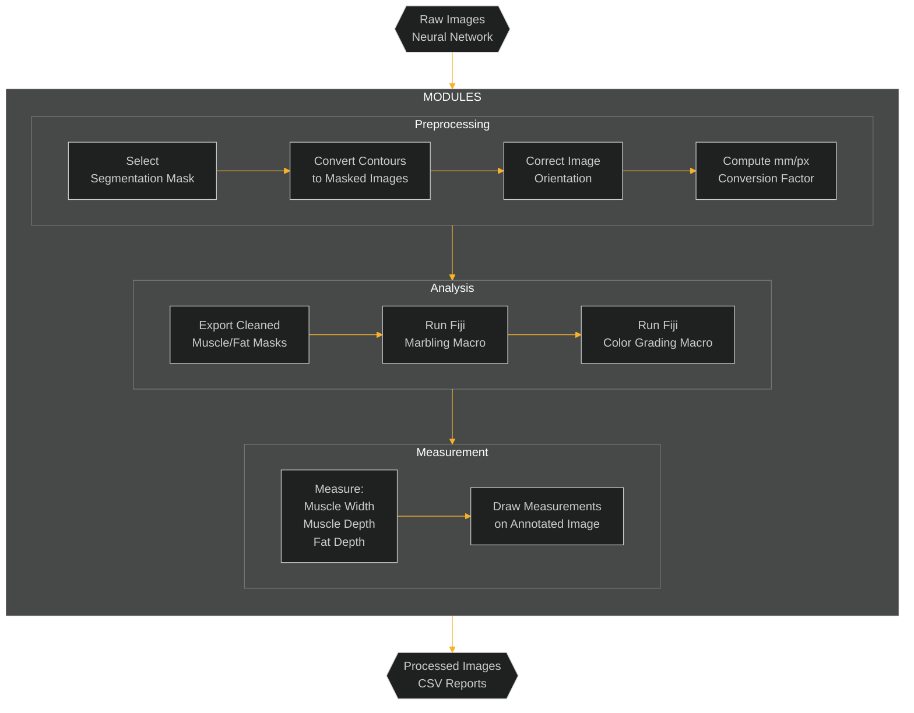

# USER GUIDE

## Table of Contents

- [USER GUIDE](#user-guide)
  - [Table of Contents](#table-of-contents)
  - [Overview](#overview)
    - [Image characteristics and measurements](#image-characteristics-and-measurements)
    - [Automated image analysis pipeline modules](#automated-image-analysis-pipeline-modules)
      - [Preprocessing](#preprocessing)
      - [Analysis](#analysis)
      - [Measurement](#measurement)
    - [Automated image analysis pipeline flowchart](#automated-image-analysis-pipeline-flowchart)
  - [Data](#data)
  - [Parameters](#parameters)
    - [General Parameters](#general-parameters)
    - [Measurement Variables](#measurement-variables)
    - [Orientation Variables](#orientation-variables)
    - [Image Processing Variables](#image-processing-variables)
  - [Usage](#usage)
    - [Pre-requisites](#pre-requisites)
      - [Programming Languages, Libraries, and frameworks](#programming-languages-libraries-and-frameworks)
      - [Installation](#installation)
    - [Instructions](#instructions)
    - [Notes](#notes)
  - [Output](#output)

## Overview

### Image characteristics and measurements

The pork chop images have the following characteristics:

- The pork loin is placed in the centre of a white tray
- Three color reference palettes are placed along the left, top, and bottom inner edges of the tray.
- A ruler is aligned consistently beside the pork chop to the right inner edge of the tray.

<p align="center">
    
</p>

In current practice, trained personnel use ImageJ along with pre-defined macros to measure features on pork chop images. These include:

- Muscle Width: The longest horizontal segment across the longissimus dorsi (LD) muscle.
- Muscle Depth: Measured 7 cm from the midline, perpendicular to the skin, at the CAN grading site (Pomar et al., 2001).
- Fat Depth: The vertical distance from skin through the fat layer above the muscle.
- Marbling: Estimated as the proportion of intramuscular fat within the LD muscle.
- Color Score: Based on proximity to standard color references.

<p align="center">
    
</p>

### Automated image analysis pipeline modules

The automated image analysis pipeline performs all image measurements indicated above, through a sequence of modular stages:

#### Preprocessing

Raw pork loin images are processed through a trained YOLOv11 segmentation model to identify **muscle** and **fat** regions. Using SAM-style mask extraction, the contours of these regions are converted into binary masks that drive all downstream analysis.

- **Mask Selection**: The model selects the most confident detections for each class (muscle = 0, fat = 1) and converts polygon contours into binary masks using `polygon2mask()`.

- **Orientation Correction**: The spatial layout of the muscle and fat masks is analyzed to standardize anatomical orientation. The image is rotated, if needed, to ensure the **fat region is always above the muscle**. A secondary fine-alignment step uses `cv2.fitEllipse()` to compute the dominant axis of the muscle and align it horizontally.
- **Scale Calibration**: The physical scale is established by detecting a known **15.5 cm ruler** in the image using **Canny edge detection** and **Hough Line Transform**. If a line is detected, a dynamic **mm/px conversion factor** is calculated. If detection fails or is out-of-bounds, a default fallback value of **10 mm / 140 px** is applied, logged, and the image is marked as an outlier.

#### Analysis

The preprocessed image undergoes marbling detection and lean color classification through externally executed **Fiji (ImageJ)** macros, which replicate established Canadian pork grading standards using rule-based image processing techniques. These macros provide a reproducible and standardized method for evaluation, aligned with historical workflows used in manual grading environments.

- **Marbling Detection**: A Fiji macro is used to generate a binary mask of intramuscular fat within the muscle region. The macro operates by applying adaptive contrast enhancement, thresholding, and connected component analysis to quantify marbling. The resulting percentage of intramuscular fat relative to the cleaned muscle mask is saved as a standardized value.

- **Color Classification**: A second Fiji macro performs detection of embedded **Canadian lean color standards** (e.g., C0 to C6) placed on the tray surrounding the loin. It calculates the mode RGB values within the defined standard chips and matches these against the lean muscle pixels using a custom lookup table. The macro outputs both a classified overlay and a summary CSV indicating the proportion of muscle mapped to each color category.

This integration ensures compatibility with legacy ImageJ workflows while enhancing reproducibility and interoperability for downstream quality control and industry validation.

#### Measurement

Geometric computations are performed to quantify key anatomical measurements from the standardized and scaled masks:

- **Muscle Width**: Measured as the **longest axis perpendicular** to the rotation angle of the muscle, using search-based traversal across the major axis.

- **Muscle Depth**: Computed by tracing a vertical line offset from the midline of the carcass, aligned to the muscle's rotation angle.

- **Fat Depth**: Determined by extending the muscle depth line into the fat mask until the top edge is reached.
- **Annotation and Export**: All measurement lines (width, depth, fat) are drawn on the rotated image. Final outputs include:

  - `output/measurement.csv` — Muscle/fat metrics in both pixels and mm
  - `output/marbling.csv` — Marbling percentage per image
  - `output/colouring.csv` — Muscle color class breakdowns
  - `output/annotated_images/` — Images with overlayed measurement lines
  - `output/rois/` — ImageJ-compatible ROI files for downstream validation

### Automated image analysis pipeline flowchart



---

## Data

The dataset used in this project was compiled from pork quality studies conducted over several years. A subset of about 100 images were used to train the neural networks employed in the pipeline. All files are in JPG format with a resolution of 5184×3456 or 3456×5184 pixels, depending on orientation. To run the analysis, images should be placed in the data/ directory and follow a consistent naming convention.

Example filename: 103_LdLeanColor.JPG

---

## Parameters

### General Parameters

| **Parameter**         | **Description**                                   | **Default Value**         |
|-----------------------|---------------------------------------------------|---------------------------|
| `--image_path`        | Path to input image(s) for processing.            | `"data/"`                 |
| `--output_path`       | Directory where results are saved.                | `"output/"`               |
| `--model_path`        | Path to the trained YOLOv11 segmentation model.| `"src/models/Yolo_MuscleFatSegment_98epoch.pt"`  |
| `--color_model_path` | Path to the trained YOLOv11 detection model. | `"src/models/color_100_last.pt"`|
| `--minimal` | Option to specify if you want to save non-outlier images    | False |
| `--debug` | Option to specify if you want to see extra information/images | False |
| `--outputs` | Option to specify which modules you would like to run (e.g. measurement, marbling, colour, all) | all |

---

### Measurement Variables

| **Variable**      | **Description**                                  | **Default Value**|
|--------------------|--------------------------------------------------|------------------|
| `cm_to_pixels`     | Conversion factor for cm to pixels.              | `140` px/cm      |
| `step`             | Step size in pixels to sample along line         | `1.0` px         |
| `max_iter`         | Maximum iterations to avoid infinite loops       |`10000` iterations|

---

### Orientation Variables

| **Variable** | **Description** | **Default Value**                     |
| ------------- | --------------- | ------------------------------------- |
| `min_area`    | Minimum area to be considered valid         | `500` px  |
| `kernel_size` | Size of the dilation kernel                 | `15` px   |
|`dilation_size`| Pixel size for dilation to define adjacency | `15` px   |

---

### Image Processing Variables

| **Variable**         | **Description**                                      | **Default Value** |
|-----------------------|------------------------------------------------------|-------------------|
| `confidence_threshold` | Minimum confidence score for valid detection | `0.4` |

---

## Usage

### Pre-requisites

#### Programming Languages, Libraries, and frameworks

| **Category**                    | **Components**       |
|---------------------------------|----------------------|
| Programming Languages           | Python, Java         |
| Libraries                       | numpy, pandas, scipy, scikit-image, pytorch, opencv, roifile, jpype1, pyimagej, ultralytics, tabulate, segment-anything        |
| Frameworks / Apps               | Fiji, ImageJ, Segment Anything, PyTorch, YOLOv11       |

#### Installation

1. Ensure you have Conda installed and are inside the root directory of the project repository.
2. Create the environment using the provided environment file:

    ```bash
    conda env create -f config/environment.yml
    ```

Also provided is a conda environment with all pinned versions of key packages used at the time of testing.  

**Note:** On certain systems (e.g., WSL), the environment creation process may appear to hang while setting up `openjdk`, `pyimagej`, or `fiji`. Please be patient; this is normal. Expect a delay of a few minutes during JAR unpacking and classpath setup, especially on first-time runs.

3. Activate the environment

    ```bash
    conda activate porkvision-1.0.0
    ```

### Instructions

Before running the pipeline, ensure that:

- All files are organized in their correct directories.
- The required models are placed in: src/models/

When executing the pipeline locally, first set the FIJI_CMD environment variable to ensure that headless Fiji macros are executed via the expected entry point bundled with the conda-installed `bioconda::fiji`:

```bash
 export FIJI_CMD=$(which ImageJ)
```

Note that the above will work only after activating the conda environment. The FIJI_CMD environment variable can verified as follows:

```bash
 echo $FIJI_CMD
```

Next, run:

```bash
python ./src/main.py
```

To execute the pipeline on an HPC with SLURM, first complete the SLURM directive placeholders and set the FIJI_CMD environment variable in porkvision.sh script and then run the following command:

```bash
sbatch porkvision.sh
```

### Notes

When running the script, ignore the following warning if it shows:

```bash
***envs/porkvision-1.1.0/lib/python3.9/site-packages/numpy/_core/getlimits.py:545:
UserWarning: Signature b'\x00\xd0\xcc\xcc\xcc\xcc\xcc\xcc\xfb\xbf\x00\x00\x00\x00\x00\x00' 
for <class 'numpy.longdouble'> does not match any known type: falling back to type probe function.
This warning indicates broken support for the dtype!
  machar = _get_machar(dtype)
```

This warning can be safely ignored and typically does not affect script execution.

Fiji execution may produce verbose Java warnings such as duplicate script language bindings (e.g., Groovy, BeanShell, Clojure). Example warnings:

```bash
[WARNING] Not overwriting name 'Groovy': ...
[WARNING] Not overwriting extension 'bsh': ...
```

These are expected and safe to ignore. Many warnings originate from classpath conflicts in SciJava and cannot be fully silenced without custom JAR pruning.

On first run of the script, Ultralytics will automatically generate a default settings file (typically in your `$HOME/.config/Ultralytics` directory). You may encounter a message like:

```bash
Ultralytics settings file not found. Creating default settings at ~/.config/Ultralytics/settings.yaml
```

This is expected and does not indicate a problem.

---

## Output

Processed results are saved in the `output` directory, organized as follows:

- **annotated_images/** – Images with visualized measurements (e.g., `annotated_*.JPG`)
- **colouring/** – Results from lean colour analysis using the Canadian 7-class standard  
  - `[image_name]/` – Diagnostic visualizations and outputs for each image:
    - `*_Color_Detect.jpg`: Color detection visualization
  - `regions/` – Intermediate processing artifacts:
    - `*_G.png`: Grayscale green-channel image
    - `*_roi.png`: Binary mask of the lean ROI
    - `*_colour.png`: Visual diagnostic image with ROI overlay
    - `*_std.txt`: Seven RGB standard color values
  - `results/` – Final outputs used for analysis or reporting:
    - `*_Canadian_LUT.png`: Merged color-labeled PNG showing lean colour classification
- **colouring.csv** – Tabular summary of color grading results for all processed images
- **debug/** – Debugging information and logs (e.g., `*_DEBUGINFO.txt`)
- **marbling/** – Results from marbling segmentation and region extraction  
  - `masks/` – Eroded masks used for lean colour intersection:
    - `*_crop.png`: Binary mask showing lean meat
  - `overlays/` – Visualization overlays:
    - `*_overlay.png`: Colour overlay of marbling on original chop
  - `regions/` – ROI processing intermediates:
    - `*_roi.png`: Eroded binary mask of the full chop ROI
- **marbling.csv** – Tabular summary of marbling measurements
- **measurement.csv** – Tabular summary of muscle and fat measurements
- **outlier** - Images identified as outliers (e.g. blurry or overexposed) are copied here
- **predict/** – Segmentation or detection overlays for each image
- **rois/** – Saved ROI files for manual review or correction, organized per image:
  - Fat, horizontal, and vertical ROI files (e.g., `*_fat.roi`, `*_horizontal.roi`, `*_vertical.roi`)
- **ruler_measurement/** – Images showing detected ruler lines and conversion factors (e.g., `*_2133px-15.5cm.jpg`)

**Example output folder structure:**

Here is an example of the output folder structure created from running the program with the 2 test image files in the data folder, one of which is a blurry image that will fail the ruler measurements and be flagged as an outlier. Sub-folders will be created for each processed image, organized by image name. CSV files provide summary tables of the analysis results.

```text
output/
|-- annotated_images
|   |-- annotated_103_LdLeanColor.JPG
|   `-- annotated_1301_LdLeanColor.jpg
|-- colour.csv
|-- colouring
|   |-- 103_LdLeanColor
|   |   `-- 103_LdLeanColor_Color_Detect.jpg
|   |-- 1301_LdLeanColor
|   |   `-- 1301_LdLeanColor_Color_Detect.jpg
|   |-- regions
|   |   |-- 103_LdLeanColor_G.png
|   |   |-- 103_LdLeanColor_colour.png
|   |   |-- 103_LdLeanColor_roi.png
|   |   |-- 103_LdLeanColor_std.txt
|   |   |-- 1301_LdLeanColor_G.png
|   |   |-- 1301_LdLeanColor_colour.png
|   |   |-- 1301_LdLeanColor_roi.png
|   |   `-- 1301_LdLeanColor_std.txt
|   `-- results
|       |-- 103_LdLeanColor_Canadian_LUT.png
|       `-- 1301_LdLeanColor_Canadian_LUT.png
|-- marbling
|   |-- masks
|   |   |-- 103_LdLeanColor_crop.png
|   |   `-- 1301_LdLeanColor_crop.png
|   |-- overlays
|   |   |-- 103_LdLeanColor_overlay.png
|   |   `-- 1301_LdLeanColor_overlay.png
|   `-- regions
|       |-- 103_LdLeanColor_crop.png
|       |-- 103_LdLeanColor_roi.png
|       |-- 1301_LdLeanColor_crop.png
|       `-- 1301_LdLeanColor_roi.png
|-- marbling.csv
|-- measurement.csv
|-- outlier
|   `-- 1301_LdLeanColor.jpg
|-- predict
|   |-- 103_LdLeanColor.jpg
|   `-- 1301_LdLeanColor.jpg
|-- rois
|   |-- 103_LdLeanColor
|   |   |-- 103_LdLeanColor_fat.roi
|   |   |-- 103_LdLeanColor_horizontal.roi
|   |   `-- 103_LdLeanColor_vertical.roi
|   `-- 1301_LdLeanColor
|       |-- 1301_LdLeanColor_fat.roi
|       |-- 1301_LdLeanColor_horizontal.roi
|       `-- 1301_LdLeanColor_vertical.roi
`-- ruler_measurement
    `-- 103_LdLeanColor_2133px-15.5cm.jpg
```
